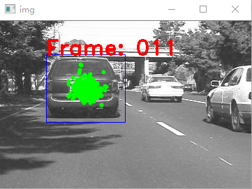

# Particle-Filter for obj-tracking 项目说明

## 简介
本项目要求实现一个粒子滤波算法来进行指定目标的跟踪。
## 依赖
* Python3
* Numpy
* path
* copy
* cv2      (需要额外安装)

---
**opencv安装**
打开Anaconda Prompt
  `> conda search opencv`  # 搜索可用的opencv版本
```
(base) C:\Users\lee>conda search opencv
Loading channels: done
# Name                       Version           Build  Channel
opencv                         3.3.1  py35h20b85fd_1  pkgs/main
opencv                         3.3.1  py36h20b85fd_1  pkgs/main
opencv                         3.4.1  py35h40b0b35_3  pkgs/main
opencv                         3.4.1  py35h6fd60c2_3  pkgs/main
opencv                         3.4.1  py36h40b0b35_3  pkgs/main
opencv                         3.4.1  py36h6fd60c2_3  pkgs/main
opencv                         3.4.1  py37h40b0b35_3  pkgs/main
opencv                         3.4.1  py37h6fd60c2_3  pkgs/main
```
`> conda install opencv=3.4.1`  # 安装符合python版本要求的opencv版本

---
## 文件结构
```
-particle_fliter_obj_tracker
---src/  # 粒子滤波程序源文件
  ---particle_filter_class.py            # 定义粒子滤波相关类、函数
  ---particle_filter_tracker_main.py     # 粒子滤波目标跟踪主函数
---data/ # 目标跟踪测试序列
  ---car/     
    ---imgs/    # 存放测试图像序列
    ---results/ # 存放跟踪结果
  ---David2/
    ---imgs/   
    ---results/
```


**particle_filter_class.py** 
* class Rect，表示图像中一个目标的矩形框
  * **这部分代码不需要修改**
  * Attr: lx, ly, w, h
    * (lx, ly): 矩形框左上角角点像素坐标，lx为列坐标，单位为像素
    * (w, h): 矩形框的宽、高，单位为像素
  
* class Particle，表示粒子滤波器中的一个粒子,实际也对应一个Rect
  * **不强制要求使用，你也可以仅用一个numpy.array来表示一个粒子**
  * **如果使用该class，你可能需要实现其中的transition成员函数**
  * Attr: cx, cy, sx, sy, weight, sigmas
    * (cx, cy): 矩形框中心点像素坐标，cx为列坐标，单位为像素
    * (sx, sy): 矩形框的宽、高与某个参考宽高的比例（e.g: sx = w/ref_w）
    * weight(**optinal**): 当前粒子的权重
    * sigmas(**optinal**): 粒子的转移概率分布标准差（表示cx,cy,sx,sy对应的概率分布标准差）
  
* 粒子滤波相关函数接口，**需要自行实现**
  * template = extract_feature(dst_img, rect, ref_wh, feature_type) —— 特征提取函数
    * 在图像dst_img上对应于rect区域的部分提取特征，用于计算不同rect之间的相似度
    * 本函数预先实现了一个基于像素强度的特征提取，会根据rect对应图像区域计算一个1 x ref_wh[0] x ref_wh[1]的特征向量
    * **可以根据需要尝试其他更优秀的特征**
  * new_particles = transition_step(particles, sigmas) —— 状态转移函数
    * 根据高斯概率分布模型来重新采样当前粒子下一个时刻的位置
    * sigmas表示粒子的cx,cy,sx,sy对应的高斯概率分布的标准差
    * **使用了Particle类的话，可以通过调用Particle的transition函数来实现**
  * weights = weighting_step(dst_img, particles, ref_wh, template, feature_type) —— 权重计算函数
    * 计算每个粒子与当前跟踪的特征匹配模板template的相似度，从而计算每个粒子对应的权重
    * **这里你需要实现一个compute_similarity(particles, template)函数，表明相似度的计算过程**
    * 返回值weights是每个粒子对应的权重，且 ***sum(weights) = 1***
  * rsp_particles = resample_step(particles, weights) —— 重采样函数
    * 根据每个粒子的权重，对其重新采样，保留或增加高权重的粒子，减少或剔除低权重粒子
    * **注意要保持粒子总数不变**

**particle_filter_tracker_main.py** 
* 粒子滤波目标跟踪主函数
* 使用相对路径来读取数据文件，因此请注意保持工程的文件结构
* **你可能会用到的参数**
  * test_split: 评估数据集名称，可选的为'car'和'David2'，前者的难度较低
  * ref_wh: 粒子的参考size，在预先实现的特征提取函数中，使用像素强度时，为了保证特征向量尺寸一致，我们统一将rect中的图像区域resize到与ref_wh一致的尺寸
  * sigmas: 粒子cx,cy,sx,sy的状态转移标准差
  * feature_type: 使用的特征类型
  * n_particles: 使用的粒子总数，值越高算法速度越慢，但是跟踪性能会越好
  * step: 读取图像序列的间隔，step=1时，会连续读取图像帧，step=2时，会隔一帧读取图像。该值越高，跟踪的难度越大
    * 想要提升跟踪任务的难度，可以考虑调低n_particles值，调高step值

* 粒子滤波过程
  * 主函数实现了一个非常简单的粒子滤波目标跟踪算法，算法主要包含四个阶段
    * **Transition阶段**：调用transition_step()函数，对粒子进行状态转移，预测当前帧的粒子分布
    * **Weighting**阶段：调用weighting_step()函数根据每个粒子与匹配模板的相似度来确定其权重
    * **Decision阶段**：根据每个粒子的权重和分布来确定当前目标的位置，以及生成下一阵的匹配模板。这里我们预设了一个最简单的策略：使用权重最大的粒子作为当前帧的跟踪结果，其对应的特征向量就是下一帧的匹配模板
    * **Resample阶段**：调用resample_step()函数，根据粒子的权重，进行重新采样分配
  * 你需要实现其中调用的extract_feature(), transition_step(), weighting_step(),resample_step()函数
    * 在weighting_step函数中，需要你明确调用一个名为compute_similarity()的子函数
  

## 任务要求
你需要实现其中调用的extract_feature(), transition_step(), weighting_step(),resample_step()函数

**且在weighting_step函数中，请明确使用 compute_similarity()这一子函数，以便于我们了解你相似度计算函数的具体设计**

---

我们在主函数中实现了一个非常初级的粒子滤波算法。**注意，这部分代码结构仅供参考，并非最佳的实现方式**

* 主函数中使用Particle的list来表示一组粒子，你也可以使用一组4 x N（或N x 4）的numpy.array来直接表示一组粒子，以便于批量的操作计算
* 注意在主循环中是从第2帧图像开始处理的，第一帧图像在主循环外部被处理
* 在运行程序后，我们可以在弹出的窗口中看到如下跟踪结果，并在对应的results文件夹下生成结果图
	

### 其他建议
* Decision阶段主要做两件事情：确定目标位置，确定下一帧匹配模板。主函数中的实现是十分初级的策略，可以考虑使用更全面的策略
  * 基于粒子的分布密度来选择目标位置
  * 联合多帧（包括初始帧）的特征向量来计算匹配模板，避免单帧错误跟踪对后续的影响
* show_img_with_rect()函数可以在图像上显示你当前的目标框、粒子分布，以便于你进行检查

