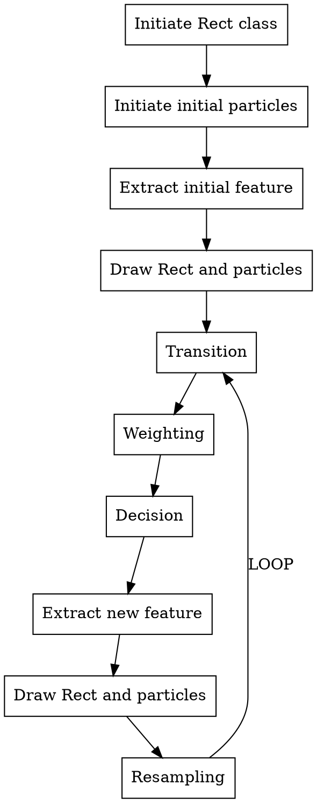

# Project 2 Solution
<div align="right">3160103838 Li Jiachen</div>

---

## Introduction
This project is designed to implement a particle filtering algorithm on object-tracking tasks.

## Prerequisite
### Files
Codes:
* *particle_filter_class.py*
* *particle_filter_tracker_main.py*

Test images:
* data
    * car
    * David2

### Environment
Only major dependences are listed.
* Anaconda Python 3.6.4
* opencv-python 3.3.0
* numpy 1.15.4

**ATTENTION:** In my Python OpenCV verison, module `cv2` cannot be successfully imported with `import cv2`, but it worked if I rewrite it as `from cv2 import cv2`. It seems that `cv2` has been wrapped twice. So in my codes, I replace `import cv2` with `from cv2 import cv2`. If you attempt to run the codes, you may need to change it back to the old style.

## Algorithm
### Flowchart


### Strategies
This part mainly discusses the implementations of contents of the preserved function interfaces.

#### Particle.transition()
This is a method of `Particle` class, serving as a converter of particle distribution between two frames. Given parameter `dst_sigmas` in order of four properties, I use Numpy API `np.random.normal()` to generate a distribution sample with these sigmas for each particle to estimate its next position. I also need four mean parameters, actually the four properties of `Particle` class, to generate the normal distribution sample.

E.g. Update one property like this.
`self.cx = int(round(np.random.normal(self.cx, sigmas[0])))`

#### extract_feature()
This function is used to extract features in terms of a vector from a certain rectangular area on the image.

Possible features:
* Intensity (default)
* HOG
* Haar feature

Details are explained in following text.

#### weighting_step()
This function computes each particle's weight via its similarity. I formulate this process into these steps:
1. Decide an extraction area
1. Extract features of selected area
1. Compute weights of features
1. Normalize the weights

With `Particle.to_rect()`, we can easily acquire a certain area based on a certain particle. Then we just use `extract_feature()` and `compute_similarity()` to get weights, where the latter function will be illustrated in following text. Finally, we use Numpy to normalize the weights, making sure that all weights sum to 1.

We have several ways to make decisions according to the weights.
* Highest-weight-only strategy
* Top-N-highest strategy

For simplisity, I use Highest-weight-only strategy, that is, considering the particle which has the highest weight as the evaluation of the object's position. This approach is achieved via deleting all the other particles except the higest weighted one and then resampling around the highest weighted particle.

#### compute_similarity()
In this function, we compute the similarity between the given feature and template. To describe the similarity, we have several choices:
* Euclidean distance
* Manhattan distance
* Chebyshev distance
* Hamming distance

Aforementioned methods are all frequently-used similarity metrics, however, I did not choose anyone of them. Instead, I adopted **cosine similarity**.

The cosine similarity is defined like this:

$$
Similarity(\bold{a}, \bold{b}) = cos\theta = \frac{\bold{a}\cdot\bold{b}}{||\bold{a}||\cdot||\bold{b}||}
$$

where $\bold{a}$ and $\bold{b}$ are vectors that have the same dimension. This equation calculate the cosine of angle $\theta$ that is formed by the two vectors, in some degree we can consider it as a indicator of the similarity of two vectors. It ranges from -1 to 1, inclusive. When two vectors are in the same direction, it gets 1; it gets -1 when two vectors go toward totally opposite directions.

So, why the cosine similarity? Of course, I have some insights. From the definition we find that the norms of vectors do not affect the angle. In other words, this metric is norm-invariant, meaning that it represent an intrinsic, solid relationship between two vectors that is hardly likely to change on a large scale. On image object-tracking tasks, it ensures the robustness. 

For example, given a selected object in a series images, when the object moves, it may be exposed to different intensity of light, which shows in terms of the change of pixel values. From the varying pixel values, the features we extract may change a lot due to different light influence (e.g., the object moves from a place in shadow to a sunlight place), but the object does not alter in aspect of semantics, for instance, a car is still a car, wherever it is in. If we directly use feature values to track, the result may oscillate greatly due to the frequent change of pixel values. But the semantic property of the object such as "where" the object is can be remained in the cosine similarity. That is why I choose such a similarity metric.

To implement cosine similarity is quite easy, using Numpy to compute the inner product and norms. Finally, do not forget to normalize the result value domain from $[-1, 1]$ to $[0, 1]$.

## Improvements
In this part, we try to optimize the tracking algorithm.

### Preprocessing
It seems that in the original code, we do not apply preprocessing on test images. Maybe it is good to centralize the images, that is, substracting the mean value of the pixels over each image, which weakens the impact of different light environments.

This is implemented with class method `Preprocess.centralize()`in the code. It operates on each image, substracting the mean value of intensities of pixels.

### Feature Extraction
Default extraction function directly extracts the normalized intensities of the pixels in ROI as a feature vector. Actually, there are a bundle of features can be exploited in computer vision field. Some traditional features:
* HOG (Histogram of Oriented Gradient) feature
* LBP (Local Binary Pattern) feature
* Haar feature (Commonly used in face detection)

I managed to apply HOG in my codes.

#### HOG
I wrote a new function `get_hog_feature()`, which accpets ROI as a parameter. It computes the HOG feature via OpenCV API `cv2.HOGDescriptor()` and its method `compute()`. The result is a numpy array feature, which is normalized and then returned.

## Performance
### Default Settings
Using default settings:

```python
ref_wh = [15, 15]
sigmas = [4, 4, 0.03, 0.03]
n_particles = 400
feature_type = 'intensity'
step = 1
```

The tracker performs successfully on both two datasets. Here are the results.

**car**

     

**David2**

     

### Other Settings
#### Intensity with Preprocessing
There is not too much improvement using centralization on each image, perhaps the light environments do not change a lot. Here are some results:

**car**

 

**David2**

 

#### HOG
```python
feature_type = 'hog'
```

When I use HOG as feature, the performing speed slows down apparently due to the increasing complexity of computation. But the results are quite good.

**car**

 

**David2**

 

### Sampling Settings
I tried several sampling parameters combinations of `sigmas`, `n_particles`, `step`. How to choose them sensibly? I think there are some insights that should be noticed when picking suitable parameters.

**Step stride and variance**
Step stride seems to be relevant with variance, that is, `step` and `sigmas` should be considered together. When we sample per frame, namely, `step` is not so large, the object actually does not move a long distance, suggesting that the next position and the former position are very close to each other. Thus, corresponding `sigmas` should also be not so large. If we enlarge the sampling interval `step`, `sigmas` gets larger as well, since the object may move to a further position so that we need to sample in a larger range.

A comparison shows the difference on *David2*. We only change `step` and `sigmas`:

```python
sigmas = [4, 4, 0.03, 0.03]
step = 10
```

 

Obviously, in frame 81, the ROI does not catch the face area well. So, let's change `sigmas`:

```python
sigmas = [10, 10, 0.03, 0.03]
step = 10
```

 

We find that the ROI catches the face area better in the same frame, especially in frame 81, which proves our hypothesis of the relationship between the step stride and the variance.

**Particle amount**
How many particles should we use? As much as possible. But we are supposed to approximate a fair amount because too many samples will lead to more time consumption on computation. I think the amount of particles should also increase with the pace of the step stride. When the step stride is large enough while the amount of particles remains unchanged, then density of particles tends to decrease, which may result in a failure in finding the object. If we add more particles, we are more likely to sample the object in that case.

One more time, let's do an experiment:

```python
step = 10
n_particles = 10 # An extreme case
```

 

Well, we see that the tracker makes a totally wrong matching with only 10 particles.

```python
step = 10
n_particles = 1000 # Another extreme case
```

 

When `n_particles = 1000`, the performance improves, though a little. It still fails to match the whole face area, since the `sigmas` is not large enough. But compared with the case when `n_particles = 10`, which misses nearly any part of the face area, this successfully matches half of the face area. To get better tracking results, we need to enlarge `sigmas`, just like what I said in the previous section.

Generally speaking, based on the experiments, perhaps we had better adopt larger variance and more particles when the step stride is big or the object moves fast.
